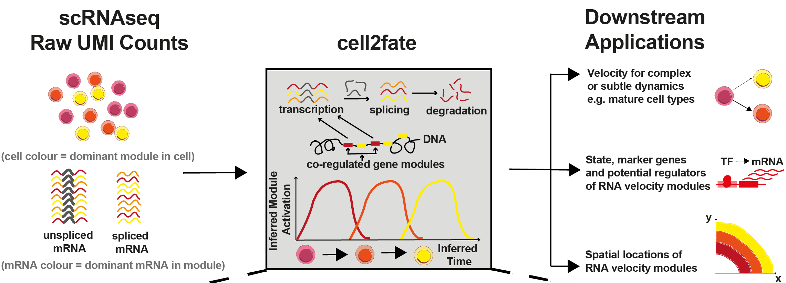

 .. cell2fate documentation master file, created by
   sphinx-quickstart on Wed Feb 4 13:32:19 2024.
   You can adapt this file completely to your liking, but it should at least
   contain the root `toctree` directive.

Welcome to Cell2Fate's documentation!
=========================================

For installation instructions please see: 

.. toctree::
   :maxdepth: 5
   
   installation

For reporting bugs or other issues with Cell2Fate please use `GitHub Issues <https://github.com/BayraktarLab/cell2fate/issues>`_.

The standard recommended workflow for using Cell2Fate can be found in the quick start tutorial.

.. toctree::
   :maxdepth: 5
   :caption: Quick start tutorial:

   notebooks/publication_figures/cell2fate_PancreasWithCC

==================================
Cell2Fate + Cell2Location Workflow
==================================

Cell2Fate RNA velocity modules can also be mapped spatially when used together with Cell2Location. To use this workflow, follow these steps:

1. Run Cell2Fate and save modules, as shown in :doc:`here </notebooks/publication_figures/cell2fate_HumanDevelopingBrain>`.
2. Install Cell2Location by following the instructions in the `Cell2Location GitHub repository <https://github.com/BayraktarLab/cell2location>`_.
3. Run Cell2Location, with the Cell2Fate modules as input, as shown in :doc:`here </notebooks/publication_figures/cell2location_HumanDevelopingBrain>`.

.. toctree::
   :maxdepth: 5
   :caption: Cell2Fate + Cell2Location:

   notebooks/publication_figures/cell2fate_HumanDevelopingBrain
   notebooks/publication_figures/cell2location_HumanDevelopingBrain
   
===========================
Scalable Cell2Fate Workflow
===========================

For very large datasets, e.g. more than 50000 cells, we provide a more scalable cell2fate workflow in :doc:`here </notebooks/additional_notebooks/cell2fate_PancreasWithCC_quantile_newclass>`. 

.. toctree::
   :maxdepth: 5
   :caption: Scalable workflow:

   notebooks/additional_notebooks/cell2fate_PancreasWithCC_quantile_newclass
   
See other notebooks to reproduce publication figures.

.. toctree::
   :maxdepth: 6
   :caption: Reproduce publication figures:

   notebooks/publication_figures/cell2fate_MouseBoneMarrow
   notebooks/publication_figures/cell2fate_PBMC_DynamicalModel
   notebooks/publication_figures/cell2fate_HumanBoneMarrow
   notebooks/publication_figures/cell2fate_MouseErythroid
   notebooks/publication_figures/cell2fate_DentateGyrus
   
.. toctree::
   :maxdepth: 5
   :caption: API:
   
   cell2fate.setup_anndata 
   cell2fate
   cell2fate.plotting
   cell2fate.general_utils
   cell2fate.pyro_infrastructure